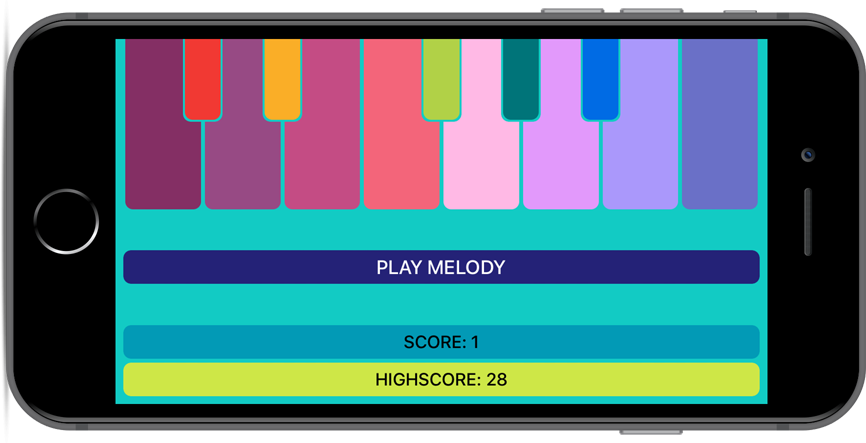
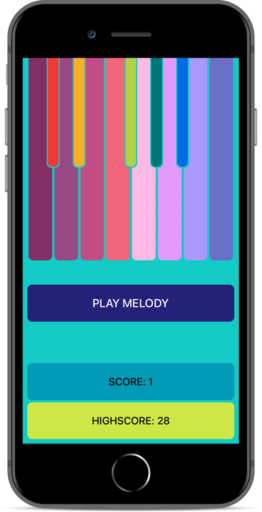

Angry Chopin
---
The app Angry Chopin plays one note which the user needs to repeat. Then next random sound is added by the app and now two of them are to be repeated by the user. Main goal of this app is to repeat as much random sounds correctly as possible. Every correctly repeated sound is scored - a great memory exercice! App uses UserDefaults to persist data.

* UserDefaults
* AVFoundation
* Property Observers
* UIGestureRecognizer
* UIKit
* Auto Layout
* Animations

